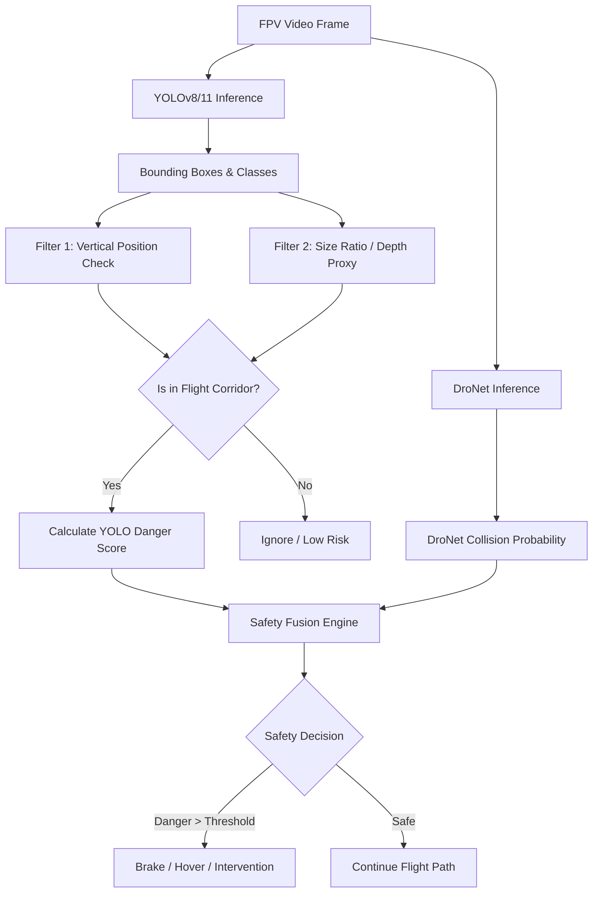

# Drone Obstacle Detection & Collision Avoidance

<p align="left">
  
  
  
  
  
</p>

An advanced, hybrid collision avoidance and obstacle detection system for autonomous drones. This project integrates the spatial object detection capabilities of **YOLO (v8/11)** with the collision probability estimation of **DroNet**, combined with a custom **Depth-Aware Safety Scoring Algorithm** to build a robust, redundant flight safety system.

---

## 📌 Core Architecture & Features

This system combines two distinct paradigms of deep learning to achieve safer autonomous navigation:

### 1. The "Waterfall Problem" Solved (Depth-Aware Safety)
Standard bounding-box detectors often fail to understand depth. A large distant structure (like a far-off mountain or waterfall) can trigger a false positive, causing the drone to halt unnecessarily. 
* Our **Depth-Aware Safety Algorithm** uses **object size and vertical frame coordinates as a depth proxy**.
* Large, distant background objects are correctly filtered out as low-risk.
* Small, close obstacles directly entering the central flight path (corridor) dynamically scale up the danger score, triggering immediate braking.

### 2. YOLO + DroNet Hybrid Fusion
* **YOLO (v8/v11):** Trained on a simplified version of the **Semantic Drone Dataset** (6 classes: `vegetation`, `structure`, `fence`, `living` (people/animals), `vehicle`, and `obstacle`). It maps *what* and *where* objects are in the frame.
* **DroNet:** A lightweight convolutional neural network that estimates continuous *collision probability* and *steering angles* based on visual input.
* **The Fusion Engine:** Merges YOLO's spatial semantics and class details with DroNet's continuous collision probabilities to eliminate false alarms and ensure double-layered safety checks.

---

## 🏗️ System Architecture



---

## 📂 Project Structure

```text
drone_obstacle_detection/
├── DroNet_plus_YOLO.ipynb     # Main development, training, and execution notebook
├── SemanticDrone.yaml         # YOLO training configuration (classes & paths)
├── class_dict_seg.csv         # Original Semantic Drone Dataset category mapping
├── yolo11n.pt / yolov8n.pt    # Pre-trained COCO base weights
├── dataset/                   # [Ignored in Git] Raw training images & masks
├── SemanticDrone-YOLO/        # [Ignored in Git] Generated YOLO dataset format
├── outputs/                   # Exported videos with overlays (Telemetry, Bounding boxes)
│   ├── hybrid_outputnew4.mp4  # Stable FPV test output
│   └── hybrid_outputnew55.mp4 # Dynamic environment test output
├── semantic_drone_training/   # Training metrics, curves, and best/last weights
│   └── yolov8n_semantic/
│       ├── weights/
│       │   ├── best.pt        # Custom YOLO weights trained on Semantic Drone Dataset
│       │   └── last.pt        # Last epoch checkpoints
│       ├── confusion_matrix.png
│       └── results.png
└── of-obstacledetection/      # Submodule containing original DroNet code & flight integration
    ├── DroNeTello/
    │   ├── models/            # Pre-trained DroNet model structures and weights
    │   ├── DroNeTello.py      # Standard Tello flight interface
    │   └── FlowDroNeTello.py  # Optical Flow-enhanced DroNet controller
    └── requirements.txt       # Core dependencies for flight tests
```

---

## 🛠️ Setup & Installation

### 1. Clone the Project
```bash
git clone <repository-url>
cd drone_obstacle_detection
```

### 2. Configure Environment
We recommend using a python virtual environment (Python 3.10+ is required):
```bash
python -m venv venv
# Windows:
venv\Scripts\activate
# macOS/Linux:
# source venv/bin/activate

pip install -r of-obstacledetection/requirements.txt
pip install ultralytics opencv-python matplotlib tqdm ipykernel
```

---

## 🚀 Pipeline Workflow

The main workflow is orchestrated step-by-step in `DroNet_plus_YOLO.ipynb`:

### Step 1: Segmentation Mask to YOLO Bounding Boxes
Converts the dense pixel-level labels of the **Semantic Drone Dataset** into lightweight YOLO bounding box format, mapping 20+ fine-grained classes into 6 major target classes:
```python
OBSTACLE_CLASSES = {
    'tree': {'seg_id': 19, 'yolo_id': 0},       # Vegetation
    'fence': {'seg_id': 2, 'yolo_id': 2},      # Fences
    'person': {'seg_id': 11, 'yolo_id': 3},     # Living Things
    'car': {'seg_id': 8, 'yolo_id': 4},         # Vehicles
    # ...
}
```

### Step 2: Custom YOLO Training
Trains the YOLO model on your converted dataset. The configuration details are parsed from `SemanticDrone.yaml`:
```yaml
path: SemanticDrone-YOLO
train: train/images
val: val/images
nc: 6
names: ['vegetation', 'structure', 'fence', 'living', 'vehicle', 'obstacle']
```

### Step 3: Run the Safety Assessment Engine
Run inferences concurrently on video streams or live FPV feeds. The telemetry overlays a central flight path boundary (35% to 65% width) and dynamically calculates real-time hazard stats.

---

## 🎮 DJI Tello Quadcopter Controls

When testing the system in a real-world environment using a **DJI Tello** drone:
1. Connect your computer to the Tello's Wi-Fi network.
2. Launch the flight script:
   ```bash
   python of-obstacledetection/DroNeTello/FlowDroNeTello.py
   ```

### Keyboard Bindings:
| Key | Command |
| :---: | :--- |
| **Tab** | Takeoff |
| **Shift** | Land |
| **Space** | Emergency Motor Shutdown |
| **W, S, A, D** | Pitch & Roll (Forward, backward, left, right) |
| **Q, E** | Yaw (Rotate counter-clockwise / clockwise) |
| **R, F** | Altitude (Move up / down) |
| **`#`** | **Arm/Disarm Autopilot (DroNet Control)** |
| **O** | Show/Hide Optical Flow Window |
| **C** | Start/Stop Video Recording |

> [!WARNING]
> Pressing any manual flight command (W,S,A,D) instantly **disarms the autopilot** for safety. Be prepared to manually override the flight paths if the drone exhibits unexpected behavior.

---

## 📊 Evaluation Metrics

The training results and performance curves are preserved under the `semantic_drone_training/yolov8n_semantic/` directory:
* **`BoxPR_curve.png` / `BoxF1_curve.png`:** Show overall precision, recall, and optimal confidence thresholds.
* **`confusion_matrix.png`:** Represents classification accuracy and identifies class leakage (e.g., distinguishing structures from generic obstacles).

---

## 🛡️ License

This project is licensed under the MIT License. See the `LICENSE` file under `of-obstacledetection/` for details.
